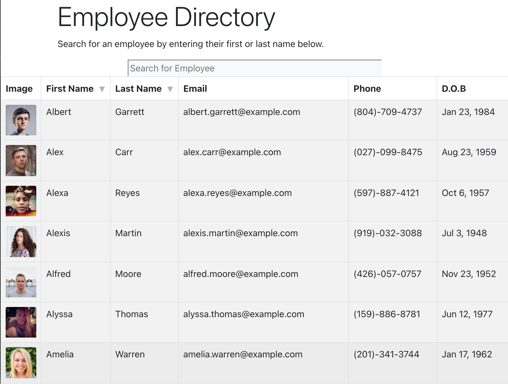

# EmployeeDirectory

## Objective
As a user, I want to be able to view my entire employee directory at once so that I have quick access to their information. I will also be able to filter employees by name.

## Overview

For this assignment, you'll create a employee directory with React. This assignment will require you to break up your application's UI into components, manage component state, and respond to user events.

## Technologies Used
* HTML
* CSS
* Bootstrap 5
* JavaScript
* axios
* gh-pages
* dateformat
* react
* readt-dom
* react-scripts
* web-vitals
* Random User API

## Licensing

## Screenshot

## View Deployed Project
https://srad25.github.io/EmployeeDirectory

## Contact

You can follow my repositories at [Github](https://www.github.com/srad25)